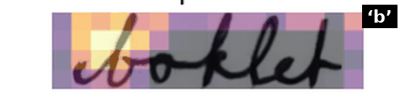
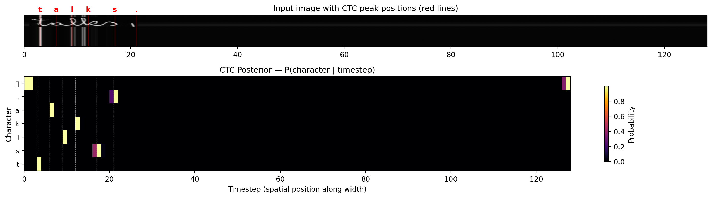

# HTR-Pipeline

**Improving HTR Attention Maps with Register Tokens — A CTC Vision Transformer for Interpretable Handwritten Text Recognition**

_Master's Project · Pattern Recognition Lab · Friedrich-Alexander-Universität Erlangen-Nürnberg_

Author: **Monika Radhakisan Chavan** · Supervisor: **Prof. Vincent Christlein** · Report date: **10 September 2026**

<p align="center">
  
</p>
<p align="center">
  <em>Per-character cross-attention rollout for the word <strong>booklet</strong>, produced from the Beyond-Memorization
  (ICDAR 2025) reproduction that anchors this project's interpretability toolkit.</em>
</p>

---

## 1 · Overview

This repository accompanies a master's project that investigates whether
**register tokens** (Darcet _et al._, ICLR 2024) improve the **attention
interpretability** of a Vision Transformer used for **handwritten text
recognition (HTR)** under **CTC** supervision, and whether they affect
recognition accuracy at IAM scale.

The public code surface is deliberately **minimal**: it contains only the
core model definition ([`models.py`](models.py)), the reusable
utilities ([`utils/`](utils/)), the YAML configurations
([`configs/`](configs/)), the synthetic-data generator
([`synthetic_data_generation/`](synthetic_data_generation/)), one curated
Jupyter notebook, and the small set of report-outline figures/tables under
[`outputs/`](outputs/). Everything else — the SLURM launchers, per-run
analysis notes, raw checkpoints, exploratory notebooks, third-party clones
(_Beyond-Memorization_, WordStylist, TrOCR/ViT weights), and the LaTeX
report source — is preserved on the author's workspace under `archive/` /
`documents/` / `experiments_execution/` / `scripts/` / `saved_models/` but
**is not published to GitHub** (see `.gitignore`).

---

## 2 · Repository layout (published surface)

```
HTR-Pipeline/
├── README.md                         ← this file
├── LICENSE                           ← MIT + attribution
├── CITATION.cff                      ← software-citation metadata
├── COMMIT_GUIDE.md                   ← step-by-step publication workflow
├── requirements.txt                  ← pinned Python dependencies
├── .gitignore                        ← publication profile
│
├── models.py                         ← HTRNet wrapper — all backbones & heads
├── configs/                          ← YAML configs for every architecture
├── utils/                            ← dataset, transforms, metrics, attention
├── synthetic_data_generation/        ← 7-step fonts → CC100 → LMDB pipeline
│
├── notebook/
│   └── beyond_memorization_attention_maps.ipynb
│                                     ← curated interactive workflow
│
└── outputs/                          ← report-outline figures & tables only
    ├── beyond_memorization/curated/
    │     └── booklet_attention_preview.gif   ← README hero animation
    ├── pub_figures/                  ← 5 camera-ready report figures
    └── tables/                       ← unified CSV + LaTeX result tables
```

`archive/` (workspace-only, git-ignored) mirrors every historical script,
notebook, checkpoint, and analysis note so nothing has been permanently
deleted. Its structure is documented in
[`archive/README.md`](archive/README.md) locally.

---

## 3 · Key claims

| # | Claim | Evidence |
|---|-------|----------|
| **A** | Register count is **CER-neutral** for CTC-ViT on IAM within seed noise (± 0.10 pp). | §4 quantitative table + [`outputs/tables/register_sweep.tex`](outputs/tables/register_sweep.tex) |
| **B** | Registers **partially improve attention quality**: character-attention entropy, peak spatial ordering (Spearman ρ), and the number of reading-order-aligned heads all improve from R = 0 to R = 8. A residual "sink" pattern survives on patch tokens because CTC self-attention lacks a CLS-style query. | §5.2/§5.3 below (from the report's register-effect analysis, §5.3 "Does the Register-Token Claim Hold in the CTC HTR Setting?") |
| **C** | SWA reliably reduces CER by 0.2–0.4 pp when the base run has already converged; it **hurts** runs that never converged. | §4 SWA-vs-no-SWA row deltas |
| **D** | For fine-tuning a pretrained ImageNet ViT-B/16 on IAM, a **~25 × differential LR** (backbone 2e-5, head 5e-4) drops test CER from 75.7 % → 15.1 % vs. naïve uniform LR. | §4 architecture-comparison table |
| **E** | The **Beyond-Memorization** (ICDAR 2025) per-character attention methodology reproduces on CTC-supervised recognisers, giving a common visualisation grammar across generative and discriminative HTR pipelines. | Booklet GIF above + [`archive/beyond_memorization_reproduction/`](archive/beyond_memorization_reproduction/) (workspace only) |

---

## 4 · Main quantitative results

All numbers are on the IAM test split (Aachen split, 2 915 lines) at
150 epochs with `seed = 42`. "True SWA CER" is the `[SWA] Test CER`
logged by the post-training averaged-model evaluation — the non-averaged
live-network CER in `results.csv` is not comparable for SWA runs.

### 4.1 Register sweep — ViT-RGTS v2 on IAM  _(Claim A)_

| Registers | No-SWA CER | No-SWA WER | **True SWA CER** | **True SWA WER** |
|:---------:|-----------:|-----------:|-----------------:|-----------------:|
|  0 | 5.74 % | 18.87 % | 5.70 % | 18.80 % |
|  2 | 5.98 % | 19.39 % | 5.70 % | 18.70 % |
|  4 | 5.96 % | 19.33 % | 5.70 % | 18.70 % |
|  8 | 5.94 % | 19.32 % | **5.60 %** | **18.60 %** |
| 16 | 5.88 % | 19.13 % | 5.70 % | 18.70 % |

Spread with SWA = **0.10 pp** — below the empirical seed-variance floor
(§4.4). Register count therefore does **not** drive CER at IAM scale.

### 4.2 Architecture comparison _(Claims C, D)_

| Architecture | Strategy | Test CER | Test WER | Parameters |
|--------------|----------|--------:|--------:|-----------:|
| **CNN-RNN** (baseline)     | + SWA                       | **4.50 %** | **15.30 %** |  7.36 M |
| CNN-RNN                    | no SWA                      | 4.89 % | 16.47 % |  7.36 M |
| **ViT-RGTS v2** (4 reg)    | + SWA                       | 5.70 % | 18.70 % |  9.48 M |
| ViT-RGTS v2 (4 reg)        | no SWA                      | 5.96 % | 19.33 % |  9.48 M |
| TrOCR-base                 | LLRD FT + SWA               | 12.10 % | 32.20 % | 90.4 M |
| TrOCR-base                 | LLRD FT (no SWA)            | 12.38 % | 32.60 % | 90.4 M |
| ViT-B/16 (ImageNet)        | 2-group LR FT               | 15.09 % | 38.19 % | 91.9 M |
| ViT-B/16 (ImageNet)        | 2-group LR FT + SWA         | 15.70 % | 39.90 % | 91.9 M |
| TrOCR-base                 | frozen encoder              | 71.98 % | ≈ 100 % |  3.72 M |
| ViT-B/16 (ImageNet)        | naïve uniform LR = 1e-3     | 73.14 % | ≈ 100 % | 91.9 M |

### 4.3 Architecture ablations _(baseline = ViT-RGTS v2, 4 reg, no SWA = 5.96 % CER)_

| Ablation | Test CER | Δ vs baseline |
|----------|--------:|--------------:|
| LR = 5e-4 (halved)          | **5.55 %** | **− 0.42 pp** |
| Depth = 8                   | 5.79 % | − 0.18 pp |
| Batch = 16 (no accum)       | 5.81 % | − 0.15 pp |
| Depth = 4                   | 6.06 % | + 0.10 pp |
| Dim = 512                   | 6.11 % | + 0.15 pp |
| SWA start = epoch 75        | 6.37 % | + 0.41 pp |
| Dropout = 0.3               | 6.42 % | + 0.46 pp |
| ViT-friendly augmentation   | 6.63 % | + 0.67 pp |
| CNN-head only (no BiLSTM)   | 6.71 % | + 0.75 pp |
| RNN 1-layer                 | 6.80 % | + 0.84 pp |
| Dim = 128                   | 6.98 % | + 1.02 pp |
| No CNN stem                 | 8.04 % | + 2.08 pp |
| ViT-RGTS v1 legacy          | 73.65 % | + 67.7 pp _(catastrophic)_ |

Load-bearing components: **CNN stem**, **BiLSTM head**, moderate width
(dim ≈ 256–512).

### 4.4 Cross-dataset generalisation & seed reproducibility

| Model | Dataset | Split | CER | WER | Notes |
|-------|---------|-------|----:|----:|-------|
| HTR-VT (R = 4)              | READ2016 | test | **4.82 %** | **20.58 %** | 80 ep, 8.75 M params |
| ViT-RGTS v2 (4 reg, seed 42)  | IAM | test | 5.96 % | 19.33 % | reference |
| ViT-RGTS v2 (4 reg, seed 123) | IAM | test | 5.98 % | 19.28 % | Δ = + 0.02 pp |
| ViT-RGTS v2 (4 reg, seed 456) | IAM | test | 5.90 % | 19.15 % | Δ = − 0.06 pp |

Empirical seed noise **≈ ± 0.10 pp** CER — establishing the significance
threshold used above.

Machine-readable versions of every table are in
[`outputs/tables/`](outputs/tables/) (`unified_results.csv`,
`architecture_comparison.tex`, `register_sweep.tex`,
`ablations.tex`, `significance_register_sweep.tex`,
`significance_vs_cnn_rnn.tex`, `statistical_tests.tex`).

---

## 5 · Main qualitative results

### 5.1 Per-character attention on Beyond-Memorization outputs — Claim E

The animation at the top of this README shows the per-character
cross-attention rollout produced by the Beyond-Memorization (ICDAR 2025)
generator on the IAM word **booklet** (writer 049 style transferred to
writer 116, `charLocation = 0`). Each frame highlights a single target
character (b → o → o → k → l → e → t) and demonstrates that a
training-free style swap yields **localised, character-consistent
attention maps**. The same visualisation grammar transfers to the
CTC-supervised HTR-VT recogniser (see report §5.2, Figure F9b).

Regenerate from the workspace-local frames:

```bash
python scripts/postprocessing/make_booklet_gif.py
# → outputs/beyond_memorization/curated/booklet_attention_preview.gif
```

The seven source PNGs and the generator script are preserved in
`archive/beyond_memorization_reproduction/` on the author's workspace.

### 5.2 Register-effect self-attention (report §5.3) — Claim B

Reading CTC self-attention row by row on the IAM sample **talks.** across
$R = 0, 4, 8, 16$ registers reveals a clear register-count effect: at
$R = 0$ the query for the first character ("t") attends broadly across
the entire image — whole vertical bands of unrelated regions light up,
the classic "attention sink" pattern Darcet _et al._ (2024) describe for
register-free ViTs, here surfacing on CTC patch tokens. At $R = 4$ the
broad bands are visibly reduced and attention concentrates on the queried
character's own stroke, though a secondary lobe on the same patch column
persists across characters. At $R = 8$ the maps become essentially clean,
narrow peaks that shift correctly with character index; at $R = 16$ the
same behaviour continues with slightly more high-frequency noise.

### 5.3 Register-effect — quantitative attention metrics (report §5.3) — Claim B

Three attention-quality metrics from
[`utils/attention_metrics.py`](utils/attention_metrics.py), computed on the
same fixed evaluation sample, corroborate the visual reading in §5.2:

- **Character-attention entropy** (lower = more focused) decreases from a
  median of **5.7 bits at R = 0 to 5.0 bits at R = 8**.
- **Spatial ordering of attention peaks** — the Spearman correlation
  between character position and attention-peak location — rises from
  **ρ ≈ 0.59 at R = 0 to ρ ≈ 0.65 at R = 8**.
- **Reading-order-aligned heads** — the count of self-attention heads
  that follow left-to-right order — grows from **≈ 8 heads at R = 0 to
  ≈ 10 heads at R = 16** (out of 8 heads/layer, averaged across layers).

One prediction from Darcet _et al._ does **not** transfer: in a
classification ViT, registers end up carrying more L2 norm than patches,
taking over the global-information role that sinks used to serve. Here,
register tokens carry **lower** L2 norm than patches at every $R > 0$ —
patches remain the higher-norm carriers, and a residual sink survives.
This is attributed to CTC self-attention lacking a dedicated CLS-style
query: patches are simultaneously query and key of the sink pattern, so
registers alone cannot dissolve that self-consistency (report §5.3).

### 5.4 CTC posterior — defines the "peak column" vocabulary

<p align="center">
  
</p>

Companion figure to §5.2/§5.3: the CTC posterior over the input columns
(character × time-step heatmap, red lines mark each character's
peak-column t_c). This is the coordinate system used to align every
attention overlay in §5 and the report.

---

## 6 · Setup

### 6.1 Requirements

- Linux, NVIDIA GPU ≥ 12 GB VRAM (reference: RTX 3080).
- Python 3.9, CUDA 12.4-compatible PyTorch (`2.6.0+cu124`).
- ≈ 15 GB disk for IAM after preprocessing; `saved_models/experiments/`
  can reach several hundred GB if all 63 experiments are re-run.
- `pdflatex` + `bibtex` if you want to rebuild the report — the source
  and the compiled PDF live in the workspace-only
  `documents/final/pr_htr_report/` folder and are not published.

### 6.2 Environment

```bash
git clone https://github.com/monikaits44/HTR-Pipeline.git
cd HTR-Pipeline

python3.9 -m venv .venv
source .venv/bin/activate
pip install --upgrade pip
pip install -r requirements.txt
```

### 6.3 Data preparation (IAM + READ2016)

The IAM Handwriting Database and READ2016 corpora are not redistributable.
Register at <https://fki.tic.heia-fr.ch/register>, download the form and
XML archives, then:

```bash
# IAM line-level splits (Aachen)
python scripts/preprocessing/prepare_iam.py \
    $IAM/forms/ $IAM/xml/ ./data/IAM/splits/ ./data/IAM/processed_lines/

# READ2016
python scripts/prepare_read2016.py --output data/READ2016/processed
```

`scripts/`, `data/`, `experiments_execution/`, `evaluation_execution/`,
and `saved_models/` live in the workspace but are excluded from the
published repository (see `.gitignore`). Clone the author's private
extension of this repo if you need the full training / evaluation
harness.

---

## 7 · Training & evaluation (workspace-only)

The public repo only ships the model definition, utilities and configs.
The full training / evaluation harness lives under `experiments_execution/`
(SLURM launchers), `scripts/trainer.py`, and `evaluation_execution/`
(batch evaluation + aggregate result generation). These directories are
intentionally excluded from GitHub via `.gitignore`; the workflow they
implement is:

```bash
# Single experiment (workspace-only)
sbatch experiments_execution/slurm_modular/iam/07_vit_rgts_v2_4reg.slurm

# Full 63-experiment matrix
bash  experiments_execution/slurm_modular/submit_all.sh

# Batch evaluate every completed run
bash evaluation_execution/batch_evaluate.sh

# Regenerate outputs/tables/ + outputs/pub_figures/
bash evaluation_execution/generate_final_results.sh
```

Contact the author or open a private issue if you need access to the
end-to-end pipeline.

---

## 8 · Configurations

| Config | Architecture | Purpose |
|--------|-------------|---------|
| [`configs/config.yaml`](configs/config.yaml) | Global defaults | seed 42, lr 1e-3, epochs 150, batch 8 |
| [`configs/baseline.yaml`](configs/baseline.yaml) | CNN-RNN (dual head) | Best-performing baseline |
| [`configs/baseline_vit_rgts_v2.yaml`](configs/baseline_vit_rgts_v2.yaml) | ViT-RGTS v2 (**recommended**) | CNN stem + 6-layer transformer + registers |
| [`configs/baseline_vit_rgts.yaml`](configs/baseline_vit_rgts.yaml) | ViT-RGTS v1 (legacy) | Kept for ablations only |
| [`configs/torchvision_vit.yaml`](configs/torchvision_vit.yaml) | TorchVision ViT-B/16 | ImageNet-pretrained backbone |
| [`configs/trocr.yaml`](configs/trocr.yaml) | TrOCR-base | HuggingFace pretrained |
| [`configs/finetune_torchvision_vit.yaml`](configs/finetune_torchvision_vit.yaml) | ViT-B/16 FT | 2-group differential LR |
| [`configs/finetune_trocr.yaml`](configs/finetune_trocr.yaml) | TrOCR FT | LLRD + gradual unfreeze |
| [`configs/htrvt_read2016_r4.yaml`](configs/htrvt_read2016_r4.yaml) | HTR-VT | ResNet stem + 2-D grid on READ2016 |
| [`configs/beyond_memorization.yaml`](configs/beyond_memorization.yaml) | Beyond-Memorization | External-repo integration |

---

## 9 · Reproducibility

- **Seed** — `seed = 42` in [`configs/config.yaml`](configs/config.yaml);
  `set_seed()` propagates it to Python `random`, NumPy, PyTorch CPU/CUDA,
  and sets `torch.backends.cudnn.deterministic = True`.
- **Software** — exact versions pinned in
  [`requirements.txt`](requirements.txt) (PyTorch 2.6.0 + cu124, timm 1.0.21,
  transformers 4.57.3, albumentations 2.0.8, editdistance 0.8.1, …).
- **Hardware reference** — NHR@FAU HPC cluster, SLURM `rtx3080`
  partition, one GPU per run.
- **Per-run artefacts** — every workspace run persists
  `config.json` (frozen configuration), `model.pt` / `model_swa.pt`,
  `results.csv`, `evaluation_details.csv`, and `training.log` so any run
  can be re-evaluated identically.

---

## 10 · Related work

- **Retsinas et al.**, "Best Practices for a Handwritten Text Recognition
  system", DAS 2022 — the CNN-RNN baseline and dual-head CTC design.
- **Darcet et al.**, "Vision Transformers Need Registers", ICLR 2024 —
  the register-token mechanism ablated in this project.
- **Gurav et al.**, "Beyond Memorization: Training-Free Style Mixing for
  Handwriting Generation", ICDAR 2025 — the per-character blob-thresholded
  visualisation methodology reproduced in §5.1 (booklet GIF).
- **Nikolaidou et al.**, "WordStylist: Styled Verbatim Handwritten Text
  Generation with Latent Diffusion Models", ICDAR 2023 — the generator
  backbone used inside the Beyond-Memorization reproduction.
- **Izmailov et al.**, "Averaging Weights Leads to Wider Optima…", UAI
  2018 — the SWA procedure used in the 150-epoch schedule.
- **Howard & Ruder**, "ULMFiT", ACL 2018 — motivation for the LLRD and
  2-group differential-LR strategies used for pretrained-backbone
  fine-tuning.
- **Li et al.**, "HTR-VT", 2024 — the ResNet-stem + 2-D-grid ViT variant
  adapted for READ2016.

---

## 11 · Citation

Please cite via the metadata in [`CITATION.cff`](CITATION.cff) or:

```bibtex
@mastersthesis{Chavan2026HTRRegister,
  title  = {Improving HTR Attention Maps with Register Tokens:
            A CTC Vision Transformer for Interpretable Handwritten Text Recognition},
  author = {Chavan, Monika Radhakisan},
  school = {Friedrich-Alexander-Universit{\"a}t Erlangen-N{\"u}rnberg,
            Pattern Recognition Lab},
  year   = {2026},
  month  = sep,
  note   = {Master's Project. Code: https://github.com/monikaits44/HTR-Pipeline}
}
```

Please also cite the upstream works listed in §10 (particularly Retsinas
_et al._ 2022 and Darcet _et al._ 2024) when using the corresponding
components.

---

## 12 · License

Released under the [MIT License](LICENSE) with attribution to the upstream
works listed in §10.

---

## 13 · Acknowledgements

This work was carried out at the Pattern Recognition Lab, FAU
Erlangen-Nürnberg, under the supervision of **Prof. Vincent Christlein**.
Compute was provided by the NHR@FAU HPC cluster. The IAM Handwriting
Database is © 2015–present RVL group, University of Bern / IAM.
READ2016 is released by the READ project.
